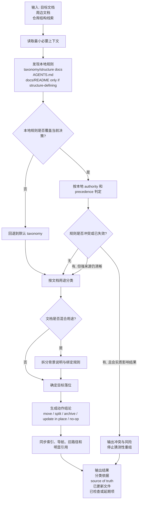

# project-doc-governance

`project-doc-governance` 是一份用于整理项目文档结构的 Codex skill。

它解决的问题不是“把文档都塞进固定模板”，而是帮助 agent 在不同仓库里先识别本地文档分类规则，再决定文档应该保留、移动、拆分、归档还是原地修订。

## 这份 skill 做什么

- 按“文档用途”而不是“文档主题”做分类。
- 优先发现并遵守仓库本地 taxonomy，而不是把某个项目的目录习惯强行套到别的仓库。
- 区分人类文档的 source of truth 和 `AGENTS.md` 的 agent-operational 角色。
- 处理常见灰区文档，例如 review notes、status docs、closeout plans、investigations、RFCs、ADRs、meeting notes。
- 在移动或拆分文档后，同步检查 `docs/README.md`、目录索引、旧路径跳转页和明显的引用关系。

## 核心原则

1. 先读最小上下文，只加载做分类真正需要的文档。
2. 先找仓库本地 taxonomy，再决定是否回退到默认 taxonomy。
3. 先解决 authority，再做分类；不要让 `AGENTS.md` 静默改写人类文档分类语义。
4. 优先做最小变更，恢复结构清晰度，而不是大规模重写。
5. 文档移动后要同步索引、导航和旧路径可达性。

## 权威来源

- [`SKILL.md`](SKILL.md) 是这份 skill 的权威执行说明。
- [`references/default-doc-taxonomy.md`](references/default-doc-taxonomy.md) 是在目标仓库缺少本地分类规则时使用的 fallback taxonomy。
- [`references/skill-review-and-remediation.md`](references/skill-review-and-remediation.md) 记录复评、整改阶段、前向试跑证据和当前评分。

README 只负责说明这份 skill 的定位、使用场景和维护入口，不重复承载完整执行规范。

## 适用场景

在下面这些情况使用这份 skill：

- 你需要判断一个 doc 该放在哪里。
- 仓库里已经有 `docs/README.md`、`AGENTS.md` 或 taxonomy 文档，但它们的边界不清。
- 一份文档混合了背景说明和实现约束，需要拆分或重新落位。
- 历史计划、阶段状态、review findings、blocker notes 需要归档但不能直接删掉。
- 你要补齐 docs 索引、归档目录或旧路径跳转页。

## 不做什么

- 不把所有仓库强制改造成同一种 docs 树。
- 不让 `AGENTS.md` 成为唯一的人类文档分类真相。
- 不因为有一点不一致就重写整套文档。
- 不在本地 taxonomy 明确存在时绕过它直接套用默认规则。

## 典型工作流

1. 读取目标文档和最少必要的周边文档。
2. 优先查找目标仓库本地的 taxonomy/structure/category docs；读取 `AGENTS.md` 作为 agent-operational 补充；只有 `docs/README.md` 明确承担 docs 结构定义时才把它作为分类依据。
3. 用 skill 内定义的 precedence 规则判断哪个文档对当前分类决策有 authority。
4. 若本地规则缺失、失效或超出覆盖范围，再使用默认 taxonomy。
5. 给出动作结论：`move`、`split`、`archive`、`update in place` 或 `no-op`。
6. 同步更新索引文档、agent 指引、旧路径跳转页和明显引用。
7. 报告已完成和已延期的完整性检查项。

## 执行逻辑图

下面这张图只展示这份 skill 的高层执行逻辑，也就是“输入什么、判断什么、输出什么”。完整规则仍以 [`SKILL.md`](SKILL.md) 为准。



## 默认整理对照表

下面这张表是 fallback 规则速查表。只有目标仓库没有本地 taxonomy，或本地规则不覆盖当前决策时，才按这张表处理。

| 文档类型 | 主要判断信号 | 默认去向 | 备注 |
| --- | --- | --- | --- |
| Active plans / blockers / migration constraints / acceptance rules | 直接影响实现、迁移、校验或评审结果 | `docs/problem/` | 属于 implementation-facing 文档 |
| Closed blockers / closeout plans / historical review follow-up | 已不再驱动执行，但保留历史有价值 | `docs/problem/archive/` | 归档而不是删除 |
| Concept explanations / learning notes / tech overviews | 主要帮助人理解概念、背景和实现思路 | `docs/knowledge/` | 默认不是执行契约 |
| Narrow operational guides / subsystem maintenance notes | 主要用于操作或维护某个子系统 | standalone guide files | 同类文件积累后再考虑独立分类 |
| ADRs | 仍是有效或已接受的架构决策 | 专用 ADR 区，或 `docs/problem/` | 若仓库已有 ADR 区域，优先用本地约定 |
| RFCs / design proposals | 仍在驱动实现讨论或等待落地 | `docs/problem/` | 被拒绝、过期或关闭后可归档 |
| Runbooks / operational playbooks | 偏操作执行，不是背景知识 | standalone guide files 或 operations-guides 区 | 除非内容纯解释性，否则不归到 `knowledge` |
| Incident reports / postmortems | 主要是历史叙述、时间线和复盘 | historical/archive 区 | 未关闭的 corrective actions 应拆到 implementation-facing 文档 |
| Release notes / changelogs | 主要是发布历史 | release-history 区 | 默认不归到 `problem` 或 `knowledge` |
| Meeting notes | 会议过程记录，不应作为权威规则来源 | historical/archive 区 | 决策和行动项要提升到权威文档 |
| Investigations / spikes | 正在支撑当前决策，或已沉淀为背景知识 | 活跃时放 `docs/problem/`，沉淀说明放 `docs/knowledge/`，关闭后归档 | 这是最典型的灰区类型之一 |
| Mixed-purpose docs | 同时包含背景说明和绑定性规则 | split | 背景去 `knowledge`，绑定规则靠近 implementation docs |

## 推荐的本地 Taxonomy 模式

如果目标仓库本身是执行驱动型项目，文档长期围绕“发现问题、分析、讨论、制定计划、跟踪状态”流转，那么比起通用 fallback taxonomy，更适合在仓库本地明确一套更直观的目录语义。

这套模式是“推荐的本地 taxonomy”，不是这份 skill 的默认 fallback。也就是说，只有仓库自己在 `docs/README.md` 或其他本地 taxonomy 文档里明确采用它时，它才应该成为 source of truth。

推荐目录如下：

- `docs/problem/`
- `docs/plan/`
- `docs/status/`
- `docs/analysis/`
- `docs/discussion/`

如果团队已经习惯 `progress/` 这个名称，可以保留 `docs/progress/` 目录名，但建议它遵循下面 `status` 的语义，而不是变成泛化的“什么进展材料都能放”的杂项目录。

每个类别下都可以有自己的 `archive/`，例如：

- `docs/problem/archive/`
- `docs/plan/archive/`
- `docs/status/archive/`
- `docs/analysis/archive/`
- `docs/discussion/archive/`

### 类别边界

| 类别 | 适合放什么 | 不该放什么 | 关闭后去向 |
| --- | --- | --- | --- |
| `problem` | 问题定义、约束、验收条件、缺陷清单、风险、阻塞项 | 已经决定怎么做的实施步骤 | `docs/problem/archive/` |
| `plan` | 已确认的实施方案、迁移计划、任务拆解、执行清单、里程碑计划 | 仍在争论的方案草稿、纯背景解释 | `docs/plan/archive/` |
| `status` | 阶段进展、状态跟踪、closeout、完成情况、阶段结论 | 问题定义本身、实施方案本身 | `docs/status/archive/` |
| `analysis` | 调研、根因分析、技术比较、实验记录、方案评估 | 最终实施命令、权威执行约束 | `docs/analysis/archive/` |
| `discussion` | 开放问题、会议讨论、RFC 草稿、尚未收敛的决策讨论 | 已定稿的实施方案、已确认的长期规则 | `docs/discussion/archive/` |

### 决策规则

这套本地 taxonomy 最好配合下面几条规则一起使用：

1. 按文档的“最强用途”分类，而不是按标题或主题词分类。
2. `problem` 负责说明“要解决什么”和“不能违反什么”，`plan` 负责说明“决定怎么做”。
3. `analysis` 是支撑判断的材料，`discussion` 是尚未收敛的争论过程；两者都不应直接充当最终执行契约。
4. `status` 只记录状态、结果和阶段结论，不回写成新的问题定义或方案正文。
5. 一份文档同时承担多种职责时，优先拆分，不要靠文件名硬撑。
6. 文档关闭后优先进入所属类别自己的 `archive/`，而不是统一塞进一个总归档目录。

### 常见灰区映射

| 文档类型 | 推荐落位 |
| --- | --- |
| Blockers / issue lists / acceptance gaps | `problem` |
| Migration plan / rollout checklist / rebuild steps | `plan` |
| Weekly status / phase closeout / stabilization summary | `status` |
| Root-cause analysis / benchmark / technical comparison | `analysis` |
| RFC draft / unresolved design debate / meeting discussion notes | `discussion` |
| Accepted RFC | 将稳定结论提升到 `plan` 或 `problem`，原讨论稿可归档到 `discussion/archive/` |
| ADR | 以理由和取舍为主时放 `analysis`；若带明确实施动作，动作部分拆到 `plan` |
| Investigation / spike | 活跃调研阶段放 `analysis`；若仍未收敛且以争论为主，可放 `discussion` |

### 扩展规则

这套模式的扩展方式应该保持克制：

1. 先用这 5 类覆盖大多数执行型文档，不要一开始就发明很多新顶层目录。
2. 只有当某一类长期积累了 2 到 3 份以上、且用途明显不同的文档时，再考虑拆出新类别。
3. 最常见的后续扩展候选通常是 `guide/` 或 `reference/`，用于承载长期稳定的 runbook、操作手册或系统说明。
4. 一旦新增类别，要在仓库本地的 `docs/README.md` 中明确它和现有 5 类的边界。

### 典型流转

这套 taxonomy 适合表达下面这种常见流转，但它不是强制流水线：

`discussion -> analysis -> plan -> status -> archive`

也可能出现这些分支：

- `problem -> plan`
- `problem -> analysis -> plan`
- `discussion -> archive`
- `analysis -> archive`

关键不是所有文档都走同一条路径，而是每个阶段的文档职责清楚、关闭后归档位置稳定。

## 仓库结构

- [`SKILL.md`](SKILL.md): skill 正文，定义触发后的执行流程、输出要求和边界。
- [`references/default-doc-taxonomy.md`](references/default-doc-taxonomy.md): 默认文档分类模型和 gray-area mapping。
- [`references/skill-review-and-remediation.md`](references/skill-review-and-remediation.md): 复盘、整改阶段、试跑记录和当前评估。
- [`scripts/basic_validate.py`](scripts/basic_validate.py): 无外部依赖的轻量校验脚本。
- [`agents/openai.yaml`](agents/openai.yaml): skill 接入配置。

## 当前状态

截至 2026-03-21：

- 已完成 Phase 1-7 整改。
- 已在两个无关仓库做 forward test。
- 其中一次真实迁移样本验证了这套模式可落地：补 `docs/README.md`、归档历史文档、保留旧路径跳转页、同步 `AGENTS.md`。
- 当前复评分记录为 `8/10`，下一阶段重点是验证“目标仓库已经存在本地 taxonomy 时”的 authority 冲突处理是否依然稳定。

详细证据见 [`references/skill-review-and-remediation.md`](references/skill-review-and-remediation.md)。

## 维护建议

- 修改分类逻辑时，优先更新 `SKILL.md` 或相应 reference，不要让 README 变成第二套规范。
- 改动 authority model、gray-area mapping 或输出契约后，更新复评记录。
- 提交前运行：

```bash
python scripts/basic_validate.py
```
